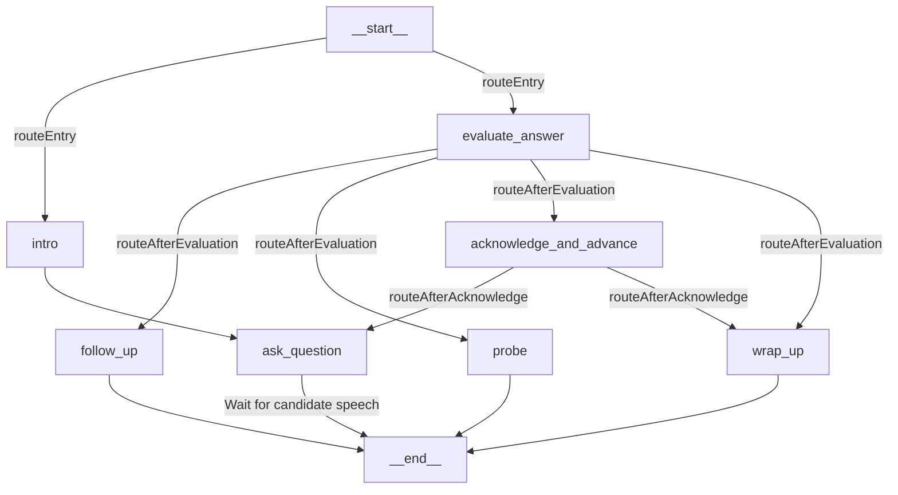

# Torque-AI Handover & Architecture Guide

This document serves as a complete context package for the **Torque-AI** (AI Mock Interviewer) application. It details how the project was started, its architecture, technology stack, features built, and the exact state of current debugging.

---

## 🚀 1. Project Genesis & Core Objective
The goal of **Torque-AI** (originally "Mind") is to build a real-time, highly interactive, conversational AI mock interviewer. The AI conducts structured phone/web screen interviews (Behavioral, Technical, System Design, HR/Culture) and evaluates the candidate in real-time, providing an intensive feedback report and score analysis based on their speech.

---

## 🛠️ 2. Technology Stack
The application is built using a modern, unified JavaScript/TypeScript stack:
1. **Frontend & Backend Framework:** Next.js 15 (App Router, Turbopack)
2. **Database & ORM:** Prisma ORM connecting to a Serverless Neon PostgreSQL database.
3. **Conversational Orchestrator:** LangGraph.js (to model the interview as a State Graph / State Machine).
4. **Real-time Voice Pipeline:** Vapi Web SDK / Vapi API (integrated with ElevenLabs for emotive voice synthesis, and Deepgram Nova-2 for ultra-fast speech-to-text transcription).
5. **Language Model:** OpenRouter API (routing completions dynamically to `openai/gpt-4o-mini` or other models).
6. **Authentication:** Custom JWT-based cookie session auth (`bcryptjs` & custom middleware).
7. **Styling:** Premium modern dark-mode UI with Vanilla CSS.

---

## 🏗️ 3. Architecture & Conversational Flow

The core of the interview experience is driven by a state machine compiled using **LangGraph.js**.

### Interactive State Graph
The interview state is tracked inside a graph schema ([lib/interview-engine/state.ts](file:///d:/Projects%20Phase%202/Mind/lib/interview-engine/state.ts)). The nodes and transitions are configured in [lib/interview-engine/graph.ts](file:///d:/Projects%20Phase%202/Mind/lib/interview-engine/graph.ts):



*   **`intro`**: Acknowledges candidate profile and starts the session.
*   **`evaluate_answer`**: Evaluates the candidate's last answer, grading it as `strong`, `vague`, or `incomplete`.
*   **`follow_up` / `probe`**: Asks follow-up or clarifying questions if answers are weak (limited to 2 per topic).
*   **`acknowledge_and_advance`**: Verbally reinforces progress, switches the topic, and routes back to `ask_question`.
*   **`wrap_up`**: Gracefully concludes the interview once the turn count limit (`maxTurns`) is reached.

---

## 📞 4. Vapi WebRTC Integration Loop
Vapi manages the low-latency voice loop. The connection flows as follows:

```
[Candidate Browser] --- (WebRTC Audio) ---> [Vapi API Servers]
                                                  |
                                            (POST Webhook)
                                                  |
                                                  v
[Candidate Browser] <-- (Emotive Audio) --- [Next.js API Webhook]
```

1. The candidate clicks **Start Interview** at `/interview/[id]`.
2. The browser initializes the Vapi Web SDK with your Public Key.
3. The browser attempts to call `vapi.start()`, passing the Vapi Assistant ID.
4. Once connected, Vapi plays the opening message.
5. When the user speaks, Vapi transcribes the audio and forwards the transcript to the **Custom LLM Webhook** (`https://torque-llm.vercel.app/api/sessions/turn`).
6. The webhook runs the turn through the LangGraph engine, saves the turns in the database, and returns the next AI response string.
7. Vapi receives the response and synthesizes it into low-latency WebRTC audio streamed back to the browser.
8. When the call ends, the browser hits `/api/sessions/[id]/end`, which compiles the final evaluation report using a high-quality model and saves it.

---

## ⚡ 5. Recent Debugging & Fixes Context

We successfully resolved several critical roadblocks leading up to the Vercel deployment:

1. **Unreachable Node & Channel Reducers (LangGraph):** Fixed graph compilation issues and corrected the LangGraph state reducers signature from `(x) => x` (which discarded updates) to `(a, b) => b ?? a`.
2. **Next.js Middleware Exclusions:** Excluded the Vapi webhook endpoint from Next.js session redirection. Without this, Vapi calls to `/api/sessions/[id]/turn` were intercepted and redirected to `/login` with a `302`.
3. **Vapi 400 Bad Request (Transient Assistants):** Vapi blocks free/trial tier accounts from passing custom LLMs in transient (inline client-side) objects. We migrated the architecture to use a registered **Vapi Assistant ID** with runtime overrides, resolving this block.
4. **Vapi 405 Method Not Allowed (Trailing Slashes):** Vapi sometimes appends a trailing slash to the webhook url (`/api/sessions/turn/`). Our middleware was updated to strip trailing slashes (`cleanPath`) before running the authentication exemption comparison.
5. **CORS / ERR_FAILED block on client-side (FIXED):** Direct browser requests to `api.vapi.ai/call/web` were being killed by adblockers/shields/ISP filtering. The Vapi Web SDK is now initialized with a same-origin base URL (`/api/vapi`), and `app/api/vapi/[...path]/route.ts` proxies call-creation requests to `https://api.vapi.ai` server-side.
6. **Custom LLM protocol mismatch (FIXED):** Vapi's `custom-llm` provider treats the configured URL as an OpenAI-compatible base URL — it POSTs `{ model, messages, stream: true, call, ... }` to `<url>/chat/completions` and expects an OpenAI chat-completion response (SSE-streamed). The old webhook returned a custom `{ message }` JSON at the bare path, so the assistant could never respond. A shared handler (`lib/interview-engine/turn-handler.ts`) now serves OpenAI-compatible streaming responses at `/api/sessions/turn/chat/completions` and `/api/sessions/[id]/turn/chat/completions` (bare `/turn` paths also still work and accept the legacy `{ candidateText }` test format). Session identity is read from Vapi call metadata (`call.assistantOverrides.metadata.sessionId`).

---

## 🔍 6. Current Handover State & Remaining Troubleshooting

For the next AI or step in development, focus on:

### Local & Production Webhook Endpoint mapping
*   **Static Endpoint:** `POST /api/sessions/turn` (Exempted from auth). This endpoint accepts Vapi payloads, extracts the `sessionId` from the Vapi `metadata` body, and forwards it to the LangGraph state processor.
*   **Dynamic Endpoint:** `POST /api/sessions/[id]/turn` (Exempted from auth). 

### Vapi Assistant settings:
*   Ensure the assistant ID on Vapi has its Model Provider set to `Custom LLM` pointing to: `https://torque-llm.vercel.app/api/sessions/turn` (Vapi appends `/chat/completions` to this URL; the route exists at both paths so either form works).
*   Verify that `NEXT_PUBLIC_VAPI_ASSISTANT_ID` and `NEXT_PUBLIC_VAPI_API_KEY` (the **public** key, not the private one) are set inside the Vercel dashboard environment variables, and a build deployment has been completed after setting them (NEXT_PUBLIC_ vars are inlined at build time).
*   The browser no longer talks to `api.vapi.ai` directly — call creation goes through the same-origin proxy at `/api/vapi/*`.
